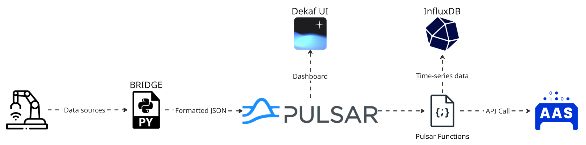

# PSS-PASS-Broker

## Table of Contents
1. [Introduction](#1-introduction)
2. [System Architecture](#2-system-architecture)
3. [Core Components](#3-core-components)
4. [Configuration Reference](#4-configuration-reference)
5. [Deployment Guide](#5-deployment-guide)
6. [Apache Pulsar & Data Processing](#6-apache-pulsar--data-processing)
7. [Running the Broker](#7-running-the-broker)
8. [Error Handling & Reliability](#8-error-handling--reliability)

---

## 1. Introduction

This project implements a modular broker to integrate industrial communication protocols, specifically **MQTT** and **OPC UA**, into a unified **Apache Pulsar** event streaming backbone.



The system facilitates the **Industrial Digital Twin** context by standardizing disparate operational technology (OT) data into a common format suitable for **Asset Administration Shell (AAS)** transposition. To manage these Digital Twins, the architecture utilizes **Eclipse BaSyx** as the core AAS middleware. BaSyx acts as the authoritative repository and management layer for AAS models, ensuring that standardized data from the industrial floor is correctly reflected in the virtual representation of the assets.

By decoupling data ingestion (Sources) from data distribution (Destinations) and utilizing a robust middleware layer, the system ensures high availability, scalability, and data integrity through features like Dead Letter Queues (DLQ) and automatic retries.

---

## 2. System Architecture

The broker operates on a **Pipeline** architecture. Each pipeline connects a specific **Source** (data producer) to a **Destination** (data consumer) via an internal standardization layer.

### 2.1 Data Flow Architecture

1.  **Ingestion**: Protocol-specific adapters (Sources) connect to external systems (MQTT Brokers, OPC UA Servers).
2.  **Standardization**: Raw data is immediately converted into an immutable `Message` object. This creates a unified internal representation, crucial for AAS mapping.
3.  **Routing & Processing**: The `Orchestrator` manages the lifecycle of these pipelines.
4.  **Egress**: The Destination adapter (Pulsar) publishes the standardized messages to specific topics.

### 2.2 AAS Transposition (Digital Twin)

To support the Asset Administration Shell (AAS) model, all incoming data is normalized into a `Message` structure:

```python
@dataclass(frozen=True)
class Message:
    source_id: str          # Originating system (e.g., "machine-1-mqtt")
    topic: str              # Specific data point (e.g., MQTT topic or OPC UA NodeID)
    payload: bytes          # The actual data value
    timestamp: datetime     # Precise UTC timestamp of the event
    metadata: dict          # Protocol-specific metadata (e.g., OPC UA Quality)
```

**Mapping to AAS:**
-   **`topic`** $\rightarrow$ Maps to the AAS **SubmodelElement** `idShort`.
-   **`payload`** $\rightarrow$ Maps to the **Value** of the property.
-   **`timestamp`** $\rightarrow$ Ensures historical traceability for the Digital Twin state.
-   **`metadata`** $\rightarrow$ Captures context like "Data Quality" (Good/Bad/Uncertain) from OPC UA.

---

## 3. Core Components

### 3.1 Sources

Sources connect to industrial devices and listen for changes.

#### MQTT Source
-   **Function**: Subscribes to a wildcard topic pattern (e.g., `test/data/#`).
-   **Behavior**:
    -   listens to all messages matching the pattern.
    -   Maps the MQTT Topic to the `Message.topic`.
    -   Captures the payload as bytes.
-   **Resilience**: Auto-reconnects on broker failure.

#### OPC UA Source
-   **Function**: Subscribes to specific Node IDs (DataChangeNotification).
-   **Behavior**:
    -   Uses `asyncua` to monitor variables.
    -   Maps the **NodeID** (e.g., `ns=3;i=1001`) to `Message.topic`.
    -   Captures the value and **SourceTimestamp**.
    -   **Quality Handling**: Extracts status codes (Good/Bad) into `metadata`.
-   **Resilience**: Handles subscription status changes and automatically attempts reconnection if the OPC UA server becomes unreachable.

### 3.2 Destinations

#### Apache Pulsar Destination
-   **Function**: Publishes standardized messages to a Pulsar cluster.
-   **Features**:
    -   **Dynamic Producer Creation**: Producers are created on-the-fly based on the incoming topic/node.
    -   **Resilience (Tenacity)**: Implements exponential backoff for connection and publication retries.
    -   **Dead Letter Queue (DLQ)**: If a message fails to publish after max retries, it is routed to a dedicated DLQ topic (`pulsar-broker-dlq`) with metadata describing the failure reason, ensuring zero data loss.

### 3.3 Orchestrator & Heartbeat
-   **Orchestrator**: Parses the `pipelines` config and initializes the required Source-Destination pairs.
-   **Heartbeat**: Monitors the health of active processes, logging status and potentially restarting stuck components.

---

## 4. Configuration Reference

The system is configured via `config.yaml`. In there it is also possible to enable/disable each source if required.

### 4.1 Sources Configuration
**OPC UA:**
```yaml
sources:
  opcua:
    enabled: true
    server_url: "opc.tcp://<host>:4840/"
    nodes_to_subscribe:
      - "ns=3;i=1001"
      - "ns=3;i=1002"
```

**MQTT:**
```yaml
sources:
  mqtt:
    enabled: true
    broker_host: "mosquitto"
    broker_port: 1883
    topic_subscribe: "factory/machines/#"
    client_id: "broker-client-1"
```

### 4.2 Destinations Configuration
```yaml
destinations:
  pulsar:
    enabled: true
    service_url: "pulsar://broker:6650" # pulsar docker container
    publishing:
      retry_attempts: 5
      dlq_topic: "persistent://public/default/pulsar-broker-dlq"
```

### 4.3 Pipelines
Define how data moves. You can run multiple pipelines simultaneously.
```yaml
pipelines:
  - name: "mqtt_to_pulsar"
    source: "mqtt"
    destination: "pulsar"
    
  - name: "opcua_to_pulsar"
    source: "opcua"
    destination: "pulsar"
```

### 4.4 Heartbeat Configuration
The broker includes a monitoring service that periodically checks the health of active processes.
```yaml
heartbeat:
  interval_seconds: 30
```
- **interval_seconds**: Defines how often the broker validates the status of internal threads and connections. Increasing this value reduces logging noise, while decreasing it allows for faster detection of failures.

---

## 5. Deployment Guide

The deployment relies on a containerized environment orchestrated via **Docker Compose**. All infrastructure configurations are located in the `Pulsar-Standard/` directory.

### 5.1 Directory Structure
Ensure your `Pulsar-Standard` folder is set up as follows:

```text
Pulsar-Standard/
├── docker-compose.yaml      # Service orchestration
├── pulsar-config/
│   └── client.conf          # Pulsar client settings
├── connectors/              # Pulsar IO Connectors (NAR files)
│   └── pulsar-io-influxdb-4.1.2.nar
├── data/                    # Persistent storage (Zookeeper, Bookkeeper, InfluxDB)
└── mosquitto/               # MQTT Broker config
└── pulsar-resources/        # Pulsar Functions
```

### 5.2 Service Stack Architecture

The `docker-compose.yaml` orchestrates a comprehensive industrial data platform. Below is a breakdown of the key services and their specific roles within this architecture:

| Service | Role | Port (Host) | Description |
| :--- | :--- | :--- | :--- |
| **Broker** | Core Messaging | `6650` (Binary), `9553` (HTTP) | The central Pulsar broker handling producers, consumers, and functions. |
| **Zookeeper** | Metadata Store | *(Internal)* | Manages cluster coordination and configuration. |
| **Bookkeeper** | Storage Engine | *(Internal)* | Handles persistent storage of messages (ledgers). |
| **Mosquitto** | MQTT Broker | `1883` | The entry point for industrial IoT devices. |
| **InfluxDB** | Time-Series DB | `8086` | Stores historical metric data processed by the broker. |
| **Dekaf** | Management UI | `8090` | Web interface for managing Pulsar tenants and topics. |

**Networking**: All services communicate via an internal bridge network (`pulsar-net`). Host ports are exposed to allow local development tools and the Broker application to connect from the host machine.

### 5.3 Installing Connectors (InfluxDB)
To use Pulsar IO connectors (e.g., `pulsar-io-influxdb`), follow these steps:

1.  **Download the Connector**: Get the `.nar` file (in our case: `pulsar-io-influxdb-4.1.2.nar`) compatible with your Pulsar version from [here](https://pulsar.apache.org/download/#connectors).
2.  **Place in Directory**: Save it to `Pulsar-Standard/connectors/`.
3.  **Mount Volume**: Ensure your `broker` service in `docker-compose.yaml` includes the volume mount for `./connectors:/pulsar/connectors`.
4.  **Configure the Sink**: You must also provide a configuration file (e.g., `pulsar-config/influxdb-sink-config.yaml`) defining the connection details:
    ```yaml
    configs:
      influxdbUrl: "http://influxdb:8086"
      token: "your-token"
      organization: "pulsar"
      bucket: "pulsar-bucket"
    ```
    This file is used when creating the sink via `pulsar-admin` to map the topic data to the database.

### 5.4 Running the Infrastructure
1.  Navigate to the directory:
    ```bash
    cd Pulsar-Standard
    ```
2.  Start the stack:
    ```bash
    docker-compose up -d
    ```
3.  Verify the broker is healthy:
    ```bash
    docker logs -f broker
    ```

---

## 6. Apache Pulsar & Data Processing

### 6.1 Overview

Apache Pulsar acts as the central nervous system of this architecture. It is a cloud-native, distributed messaging and streaming platform that ensures decoupling between the high-frequency industrial data ingestion (MQTT/OPC UA) and the downstream Digital Twin systems (AAS). We utilize it for its high throughput, low latency, and built-in support for *"Functions"*, which are lightweight scripts that operate directly on topics and help transforming data or perform event-based actions.

### 6.2 Management UI: Dekaf

To visualize topics, monitor message throughput, and manage namespaces, we utilize **Dekaf UI**, a modern, lightweight web interface for Pulsar.

Dekaf provides a user-friendly dashboard to inspect tenants, namespaces, topics, and subscriptions without needing complex CLI commands.
*   **Documentation & Repo**: [https://github.com/visortelle/dekaf](https://github.com/visortelle/dekaf)

### 6.3 Pulsar Functions

Pulsar Functions allow us to run serverless-style logic directly on the message bus. In this project, we use a custom **Go function** (`basyxupdater.go`) to act as the bridge between the raw Pulsar messages and the AAS server (Eclipse BaSyx).

**Role of `basyxupdater`**:
1.  **Ingest**: Reads JSON messages from the `test-data` topic.
2.  **Process**: Parses updates for AAS Submodels (identifying `idShortPath` and values).
3.  **Patch**: Sends HTTP PATCH requests to the BaSyx API server to update the Digital Twin.
4.  **Log**: Writes historical data points to **InfluxDB** for time-series analysis.

*Note: Currently, configuration values (InfluxDB URL, BaSyx URL) are hardcoded in the Go file. Additionally, the function is currently designed to operate specifically on the `"test/data/test-data"` topic. Future iterations will aim to externalize these parameters.*

### 6.4 Creating & Deploying Functions

The following guide details how to compile and deploy the `basyxupdater` function into the Pulsar broker container.

#### Prerequisites
*   `function-config.yaml`: Defines the function name, input topics, and runtime.
*   `basyxupdater.go`: The source code.

#### Step 1: Cross-Compile for Linux/AMD64
Since the Pulsar broker runs in a Linux Docker container, we must cross-compile the Go binary from the host machine.

Open PowerShell in the project root:
```powershell
# 1. Set environment variables for cross-compilation
$Env:GOOS = "linux"
$Env:GOARCH = "amd64"

# 2. Initialize Go module (if not already done)
go mod init basyxupdater
go get github.com/apache/pulsar/pulsar-function-go/pf
go get github.com/influxdata/influxdb-client-go/v2

# 3. Compile the binary
go build -o basyxupdater basyxupdater.go
```

#### Step 2: Transfer Files to Container
Copy the compiled binary and configuration file into the running Pulsar broker container.
```powershell
# Check your container name (usually 'pulsar' or 'broker')
docker ps

# Copy files to a temporary path inside the container
docker cp basyxupdater broker:/pulsar/download/basyxupdater
docker cp function-config.yaml broker:/pulsar/download/function-config.yaml
```

#### Step 3: Register the Function
Execute the creation command inside the container.
```bash
# Enter the container
docker exec -it pulsar bash

# Create the function
pulsar-admin functions create \
  --go /pulsar/download/basyxupdater \
  --function-config-file /pulsar/download/function-config.yaml
```

#### Step 4: Verification
Verify that the function is running and registered correctly.

```bash
# Check configuration
pulsar-admin functions get --name basyxtest --tenant public --namespace default

# Check runtime status
pulsar-admin functions status --name basyxtest --tenant public --namespace default
```
*Result: You should see `"running": true` in the JSON output.*

---

## 7. Running the Broker

The broker is the application that bridges the sources (MQTT/OPC UA) to the Pulsar backbone. It should be started after the infrastructure (Section 5.4) is up and running.

### 7.1 Build the Docker Image
From the root directory of the project, build the container image:
```bash
docker build -t pss-pass-broker:0.1 .
```

### 7.2 Run the Broker
To run the broker and connect it to the Pulsar network:
```bash
docker run --rm \
  --name pss-pass-broker \
  --network pulsar-net \
  pss-pass-broker:0.1
```

### 7.3 Configuration Override (Optional)
If you want to use a different configuration file without rebuilding the image, you can mount it as a volume:
```bash
docker run --rm \
  --name pss-pass-broker \
  --network pulsar-net \
  -v ${PWD}/custom-config.yaml:/app/src/config.yaml \
  pss-pass-broker:0.1
```

---

## 8. Error Handling & Reliability

-   **Connection Loss**: Both MQTT and OPC UA sources have internal loops to attempt reconnection indefinitely (with backoff).
-   **Publication Failure**: If Pulsar is down, the system retries 5 times (configurable).
-   **Data Safety**: Failed messages are **never** discarded silently. They are written to the DLQ. Administrators should monitor the DLQ topic to replay or investigate failed messages.

---

